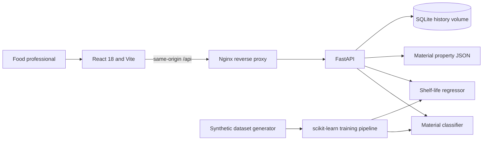

# Packwise: Food Packaging Recommendation System

Packwise is a decision-support application for comparing food packaging materials against a food profile and its storage and transport conditions. It combines a synthetic-data scikit-learn pipeline, a FastAPI service, SQLite recommendation history, and a responsive React dashboard.

> **Important:** Training data is synthetic. Recommendations and shelf-life estimates are not food-safety certifications, regulatory advice, or laboratory-validated claims. Validate packaging performance and shelf life under the intended conditions before use.

## What It Does

- Accepts food category, moisture, fat, pH, water activity, sensitivities, storage conditions, transport duration, shelf-life target, budget, and sustainability priority.
- Returns up to three material options with classifier probabilities, a profile-level shelf-life estimate, a suitability score, catalogue properties, and an explanation.
- Applies explicit safety filters to exclude some unsuitable recommendations and shows warnings for unsafe materials selected for comparison.
- Stores submitted recommendations in SQLite.
- Provides material comparison, searchable material properties, recommendation history, and model evaluation views.

The shelf-life model receives the food and storage profile, not a candidate packaging material. Its estimate is therefore profile-level and is not a material-specific prediction.

## Architecture



## Project Layout

```text
backend/
  app/                 FastAPI routes, schemas, services, database, and settings
  data/                Generated dataset and material property catalogue
  ml/                  Dataset generation and model training scripts
  ml/artifacts/        Trained pipelines, metrics, and model comparisons
  tests/               API integration tests
  requirements.txt
  Dockerfile
frontend/
  src/                 React routes, components, hooks, API client, and tests
  Dockerfile           Vite build served by Nginx
  nginx.conf            SPA fallback and /api reverse proxy
  package.json
  package-lock.json
  vite.config.js
  tailwind.config.js
docker-compose.yml
```

## Requirements

- Python 3.11 (the backend Docker image uses Python 3.11)
- Node.js 20 or newer and npm
- Docker Engine with the Compose plugin for container deployment

## Run Locally

### Backend

From the repository root, create and activate a virtual environment, install dependencies, generate data, and train the models:

```powershell
py -3.11 -m venv .venv
.\.venv\Scripts\Activate.ps1
python -m pip install -r backend\requirements.txt
python backend\ml\generate_dataset.py
python backend\ml\train.py
$env:PYTHONPATH = "backend"
uvicorn app.main:app --app-dir backend --reload
```

The API is at `http://localhost:8000`; Swagger UI is at `http://localhost:8000/docs`. The API loads the generated joblib pipelines on startup and creates the SQLite database at `backend/data/food_packaging.db` by default. Settings can be overridden with environment variables or a root `.env` file; see [.env.example](.env.example).

### Frontend

In another terminal:

```powershell
cd frontend
npm ci
npm run dev
```

Vite serves the app at `http://localhost:5173` and proxies `/api` requests to `http://localhost:8000`. Run frontend unit tests with `npm test` and build the production bundle with `npm run build`.

### Tests

From the repository root, with the backend virtual environment active:

```powershell
$env:PYTHONPATH = "backend"
python -m pytest backend/tests -q
```

The backend integration tests load the trained artifacts and use a temporary SQLite database. Frontend tests use Vitest, jsdom, and React Testing Library.

## Run with Docker Compose

From the repository root:

```powershell
docker compose up --build
```

The backend image generates the synthetic dataset and trains both pipelines during image build, so a clean checkout does not need ignored local model artifacts. Compose exposes the frontend at `http://localhost:5173`, the API at `http://localhost:8000`, and Swagger UI at `http://localhost:8000/docs`. Recommendation history is stored in the named `packwise-data` volume and survives container recreation.

To stop the services while preserving history:

```powershell
docker compose down
```

To remove the Compose-managed history volume too:

```powershell
docker compose down --volumes
```

The compose file supports `FRONTEND_PORT` and `BACKEND_PORT` overrides, for example `$env:FRONTEND_PORT = "5174"` before starting Compose.

## Deploy to Render

The repository includes a Render Blueprint at `render.yaml` with a Docker-based FastAPI service and a static Vite frontend. To deploy, open the Render Blueprint flow, connect the GitHub repository, review the two services, and apply the Blueprint. Render assigns public service URLs; the frontend build is configured to call the API service.

The Blueprint uses free services and SQLite on the API container's ephemeral filesystem. **Recommendation history can be lost when the API service restarts, redeploys, or spins down.** For durable history, attach a persistent disk to the API service and mount it at `/app/var`, or use a managed database and update `DATABASE_URL`.

The first API image build generates the synthetic dataset and trains both models, so allow extra build time. Render may require an authenticated GitHub connection and an active account before it can create services.

## API Reference

All endpoints are under `/api`:

| Method | Path | Purpose |
|---|---|---|
| `GET` | `/health` | API and model readiness |
| `POST` | `/recommend` | Validate a food profile, return material recommendations, and save history |
| `GET` | `/materials` | List materials; supports `search` and `cost_level` query filters |
| `GET` | `/materials/{name}` | Retrieve one material's properties |
| `GET` | `/foods` | Food categories and default profile presets |
| `GET` | `/history` | Paginated history; supports `limit`, `offset`, and `food_category` |
| `DELETE` | `/history/{id}` | Delete one history record |
| `GET` | `/model/metrics` | Saved classifier/regressor metrics, feature importance, and confusion matrix |
| `POST` | `/compare` | Score two or three material choices for one food profile |

FastAPI validates request fields and returns validation details with HTTP 422. API documentation and request schemas are available at `/docs`.

## Frontend Routes

- `/` landing page
- `/recommend` three-step food profile wizard
- `/results` recommendation details, radar/bar charts, and PDF report export
- `/compare` material comparison
- `/materials` searchable and filterable material library
- `/history` saved recommendation history
- `/insights` model performance and confusion matrix

The interface supports light/dark themes, responsive layouts, loading/error/empty states, keyboard-operable menus and dialogs, and reduced-motion preferences.

## Model Pipeline

`backend/ml/generate_dataset.py` creates 5,000 rule-based synthetic examples by default and writes `backend/data/food_packaging_dataset.csv` plus `backend/data/materials.json`. `backend/ml/train.py` compares Random Forest, Gradient Boosting, and Logistic Regression classifiers, and Random Forest and Gradient Boosting regressors. It uses a stratified holdout, five-fold cross-validation, a small grid search, and writes the selected joblib pipelines and metrics under `backend/ml/artifacts/`.

Regenerate and retrain locally with:

```powershell
python backend\ml\generate_dataset.py
python backend\ml\train.py
```

Use `--rows` and `--seed` on the generator to change dataset size and reproducibility seed. Model metrics describe agreement with synthetic rules and must not be interpreted as real-world performance.

## Screenshots

Screenshots are not checked into the repository. Run the frontend locally or with Docker Compose to view the application.

## Known Limitations and Future Work

- Replace synthetic training examples with validated experimental and commercial data before operational use.
- Validate shelf-life estimates against laboratory studies and extend the model to condition estimates on candidate packaging.
- Normalize and label model feature importance according to a documented interpretation method.
- Add authentication and user-scoped history before exposing the service to multiple users or the public internet.
- Add stronger food-contact compliance, regional recycling, and material compatibility guidance.
- Add automated end-to-end tests for clean Docker startup, model training, browser layouts, and real file downloads.
